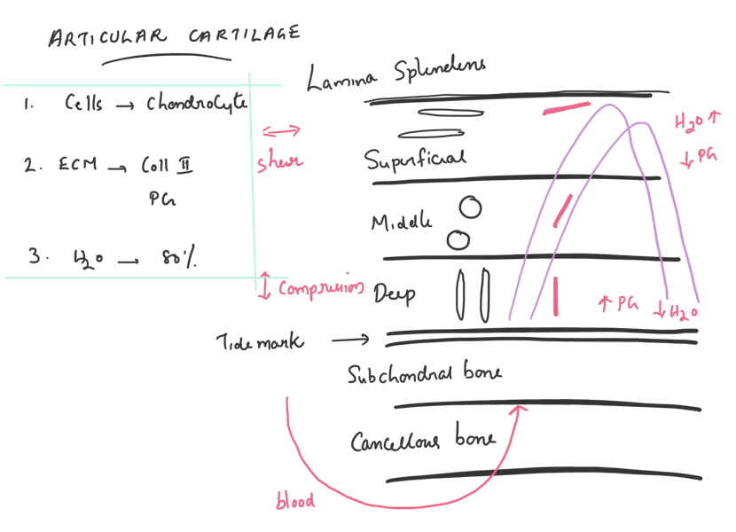

# (PART) Orthopaedic Diagrams{-}
# Diagrams for viva

## Action potential

```{r echo=FALSE,out.width="100%", fig.cap="Action Potential"}

```

## Articular cartilage

```{r echo=FALSE,out.width="100%", fig.cap="Articular cartilage"}

```

## Femoral head supply

```{r echo=FALSE,out.width="100%", fig.cap="Blood supply femoral head"}
knitr::include_graphics("image/bldfr.PNG")
```

## Brachial Plexus

```{r echo=FALSE,out.width="100%", fig.cap="Brachial Plexus"}

```

## Carpal Tunnel

```{r echo=FALSE,out.width="100%", fig.cap="Carpal tunnel incision"}
knitr::include_graphics("image/cts2.PNG")
```

```{r echo=FALSE,out.width="100%", fig.cap="Carpal tunnel contents"}
knitr::include_graphics("image/cts.PNG")
```

## Cement

```{r echo=FALSE,out.width="100%", fig.cap="Curing of bone cement "}
knitr::include_graphics("image/cement.PNG")
```

## Motion segment

```{r echo=FALSE,out.width="100%", fig.cap="Motion segment"}
knitr::include_graphics("image/motion.PNG")
```

## Femoral teardrop

```{r echo=FALSE,out.width="100%", fig.cap="Tear drop and lines"}
knitr::include_graphics("image/teardp.PNG")
```

## Spinal cord

```{r echo=FALSE,out.width="100%", fig.cap="Spinal cord cross section"}
knitr::include_graphics("image/spcd.png")
```

## Nerve
```{r echo=FALSE,out.width="100%", fig.cap="nerve"}
knitr::include_graphics("image/nerve.PNG")
```


