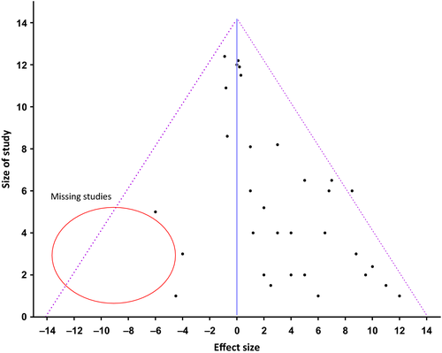
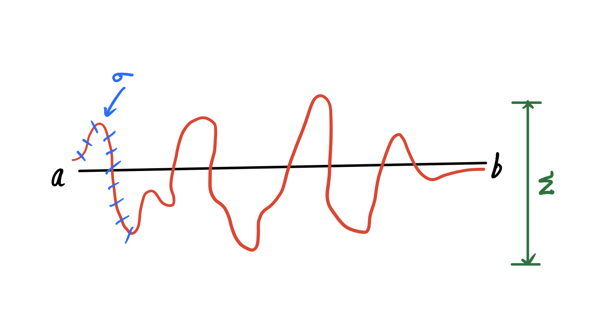

# (PART)  Research {-}
# Research Methodology
## p-value and CI


```{r echo=FALSE, warning=FALSE}
library(ggplot2)
set.seed(1)
m=rnorm(100,168,5)
f=rnorm(100,158,5)
mf=data.frame(m,f)
```
```{r include=FALSE}
library(tidyverse)
```
```{r echo=FALSE, fig.cap="Histogram showing  male and female height ploted againt the count", out.width="100%"}
mf %>%
  ggplot()+
  geom_histogram(mapping = aes(m, colour="male"
              ),position = 'identity',bins=70, alpha=.5, )+
  geom_histogram(mapping = aes(f,colour="female"
              ),position = 'identity',bins = 70, alpha=.5)+xlab("People")
```


```{r include=FALSE}

mm= mean(m)
mf= mean(f)
htdif=mean(m)-mean(f)
round(htdif,digits = 1)
```
Assume that we have a normally distributed population of males and females with a mean height of `r mm`cms and `r mf`cms respectively.

We can see that the mean difference in the height is `r htdif`  
**If I measure the entire population in the world, will I find that the mean height for each sex is different?** or  
**would I find that difference between the mean height is zero?**

##### How to answer this question?

#### Frequentist method
Assume a hypothetical world with no difference in the height between the sexes.Do repeated experiments and find out what `proportion of times` would I obtain a difference between the observed means(ø) in that hypothetical world which is as great as or greater than difference I observed in my real experiment.
**This proportion of time is abbreviated as *p-value* **  

In other words *p-value*=P(ø/H), given the null(H), what is the probability of data(ø)

but *p-value* is an answer to a question we didn't intend to ask. So what to do with it?

#### Traditional Answers

##### Fisher

Treat it as a measure of strength of evidence. This is not objectively satisfactory because, *p-value*=P(ø/H)≠P(H/ø)

##### Neyman-Pearson decision framework

In each experiment, if you need to choose between the Null and the alternative, then there is possibility for two types of errors

False Positive: Choosing the alternative when Null is true

False Negative: Choosing the Null when the alternative is true

>>**Control the rate at which you commit decision errors of false positive type by applying a strict procedure to each experiment:**

**The researcher has to make a decision**. In research, convention is to choose the alternative hypothesis if the test result is outside the 95% mark in the normal curve. The remaining 5% is called `œ`. The boundary is approximately `1.96z`, ie,  1.96 standard deviations away from the mean.

>A Z-score is a numerical measurement that describes a value's relationship to the mean of a group of values. Z-score is measured in terms of standard deviations from the mean. If a Z-score is 0, it indicates that the data point's score is identical to the mean score. A Z-score of 1.0 would indicate a value that is one standard deviation from the mean. Z-scores may be positive or negative, with a positive value indicating the score is above the mean and a negative score indicating it is below the mean.

>`œ` is the zone of rejection of null hypothesis and `z` the boundary between the acceptance and rejection zones of  null hypothesis.

If we refer the statistical charts, p value for a `z` score of ≤1.96 is ≤0.05

##### So the decision framework is to

 + Compute *p-value*
 + Choose the Null if *p-value* is > α 
 + Choose the alternative if *p-value* is <= α
 + Typically α is set at 0.05

Another important concept is **confidence interval**

## Confidence Interval

Under repeated sampling in hypothetical world, 95% of confidence intervals constructed the same way will include the true value of the mean difference.

It ranges between a fixed value x and y on either side of zero,i.e., `x-0-y`. 

0-x is the lower confidence limit and 0+y is the upper confidence limit.

##### **Confidence limit**
 This sets the boundary of confidence interval and it is generally taken as 95%.

confidence interval is generally considered as more important than p value because it gives

+ Statistical significance
+ Clinical significance
+ Precision

## Funnel plot

**Introduction**

#### Talking the talk

```{r funnel1, echo=FALSE, fig.cap="Funnel Plot", out.width="100%"}
knitr::include_graphics("image/funnel2.png")

```

**Doctor,what do you see here?**

This is called a funnel plot which is a simple scatterplot of the treatment effects (RR or OR) estimated from individual studies (horizontal axis) against the precision of the studies represented by standard error (SE).

The vertical dotted line shows the estimated combined RR or OR from the meta-analysis. The diagonal dotted lines show the range in which studies should be ideally distributed given the size (and thus precision) of each study. Thus larger (big sample size), more precise (smaller standard error) studies should be closely distributed either side of the pooled effect and smaller studies should be distributed more widely giving the classic inverted symmetrical funnel. If the studies are not distributed randomly (due to sampling error) around the combined RR estimate then some other influence is suggested.

```{r funnel2, echo=FALSE, fig.cap="Assymetric Funnel Plot",out.width="100%"}


```

**Now what is this?**

This funnel plot shows trials scattered asymmetrically around the pooled RR with smaller trials reporting a greater effect than larger ones.

Two possible explanations are: smaller trials of lower methodological quality tend to overestimate true effect; **publication bias** has led to the smaller negative trials remaining unpublished.

```{r funnel3, echo=FALSE, fig.cap="Outliers, Funnel Plot",out.width="100%"}
knitr::include_graphics("image/funnel4.png")

```

**If so, what is this?**

The funnel plot displays the % of observed 30-day mortality rate of operations on the Y-axis and the total number of operations on the X-axis. A practice lying on the line Y=1 has a surgeon performing close to average, whereas a practice lying above Y=1 has a the total number of operations that is higher than the average.

**Important point**

Funnel plot is used to detect publication bias as well as outliers

#### **Funnel plot**

This is a common question for FRCS(Tr & Orth) viva. To understand the concept, we have to give some thought in to the basis of this statistical tool. Let us start from the very base.

#### Understand the concept

Mean, median, and mode are three kinds of "averages". There are many "averages" in statistics, but these are most common.

**"mean"** is a statistical "average", where you add up all the variables and then divide by the number of variables.

The **"median"** is the **"middle"** value in the list of variables. To find the median, your variables have to be listed in numerical order from smallest to largest, so you may have to rewrite your list before you can find the median.

The **"mode"** is the value that occurs most often. If no variable in the list is repeated, then there is no mode for the list.

To understand funnel plot we should also know the statistical concepts of  *variance* , *standard deviation* and *standard error of mean*.

## Variance

**It is the sum of average squared difference of mean**.

eg: x\~1, x\~2, x\~3, x\~n are a list of *n* number of values, then mean, x̄ = (x\~n + x\~1 )/n. Then the **Variance**=Σ (x-x̄)\^2/ (n-1).

## Standard deviation

*It is the measure of standardized dispersion of data from the mean. It is calculated by taking the square root of variance.*

Standard deviation σ = √∑, i.e., standard deviation is the square root of variance.

Assume that someone is asked to walk on a straight line from point *a* to point *b*. The individual steps taken by the person can be equated to standard deviation and the variance is the deviation of the path from the central line.

```{r funnel4, echo=FALSE, fig.cap="walking with variance and sd", out.width="100%"}


```

σ is the sd and Σ is the variance

> Unlike standard deviation **variance** can identify the outliers and also shows the spread of the data.

## standard error of mean(SEM)

It is the standard deviation of the sample mean from the population mean.

Assume that there is a population of 1000 members. In order to study the average height of the population, we have to select a sample size. Also assume that one scientist *y* started a study with a sample size of 50. He repeated the study for *n* times. He found that each time the average height found out from the study was different. He calculated the mean value of the height from these *n* studies and designated it as x̄\~1. This x̄\~1 is the **sample mean** for his study.

Another scientist *z* selected a sample size of 10 and conducted *n* number of similar study and similarly he also got a sample mean, x̄\~2. So they decided to find out the actual population mean x̄ by studying the entire population. They also calculated how far the x̄\~1 and x̄\~2 deviate from x̄. The deviation of x̄\~1 was found to be less than x̄\~2. This deviation is called **Standard error of mean**

> when *n* increases, **standard error of mean** decreases and the precision of the study increases.

**This is the basis of funnel plot.**

#### Funnel plot concepts

It is a representation of **SEM** plotted against the true population mean or the no effect line of a study in a graph. Smaller studies tend to have larger SEM and the larger studies will have smaller SEM. Hence the plot assumes a funnel shape. I an ideal world, **funnel plot** is supposed to form a symmetrical "funnel". This is not the case in real world, because of various reasons.

#### Uses of funnel plot

-   To identify outliers. Eg: A surgical resident's performance
-   To identify the validity of a meta-analysis. An asymmetrical funnel plot suggests a potential problem with the results of the meta-analysis.

#### Causes of asymmetrical funnel plot

1.  Reporting bias

    -   Reporting bias

        -   Publication bias: Delayed reporting, language bias, duplication)
        -   Selective outcome reporting
        -   Selective analysis reporting

2.  Poor methodology

    -   Design
    -   Analysis
    -   Fraud

3.  Heterogeneity

4.  Chance

#### Heterogeneity

**Variations over and above that is expected by chance**

predicts whether the data from different studies can be combined for meta-analysis to obtain a forest plot.

##### Causes

| Clinical                          | Statistical                         |
|-----------------------------------|-------------------------------------|
| Difference in the population      | Individual results are inconsistent |
| Difference in the study design    | Difference in size of benefit       |
| Difference in intervention        | Difference in size of harm          |
| Difference in outcome             |                                     |
| Always present                    |                                     |
| Cannot be statistically evaluated | Can be evaluated statistically      |

#### Detecting Heterogeneity

-   Review the table describing individual studies
-   "eye ball test", review the forest plot
-   Review the statistical tests
-   Statistical tests

#### Statistical tests for detecting heterogeneity

-   Tests for its presence: Chi Square test, p>0.1 means study is homogenous

-   Test to quantify: I\^2

    -   It measures the % of heterogeneity (≤25%----low, 50%----moderate, ≥75%----high)

#### Analysis of cause of heterogeneity

Once heterogeneity is identified and quantified, he have to analyze and find out why it is present

##### This is done by

-   subgroup analysis
-   Metaregression


