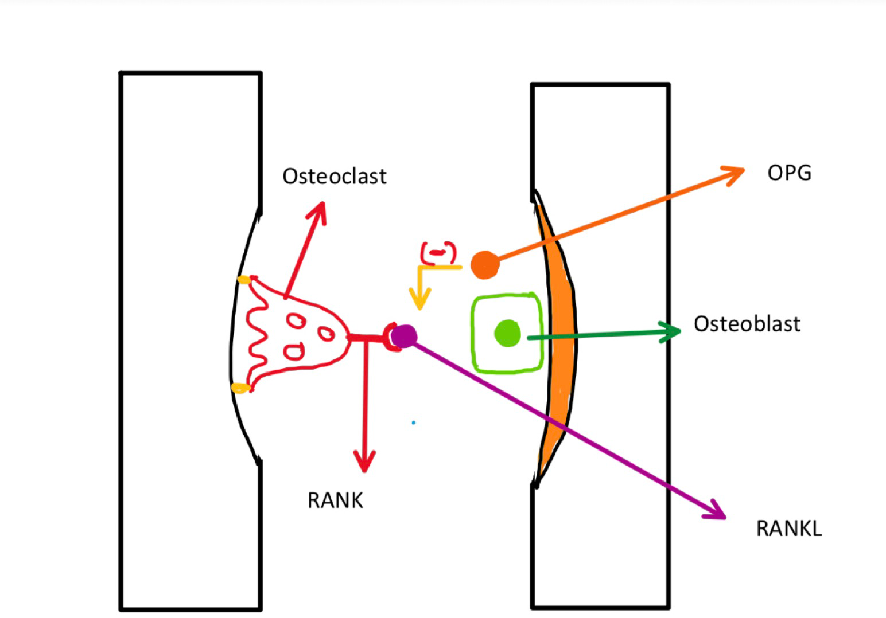
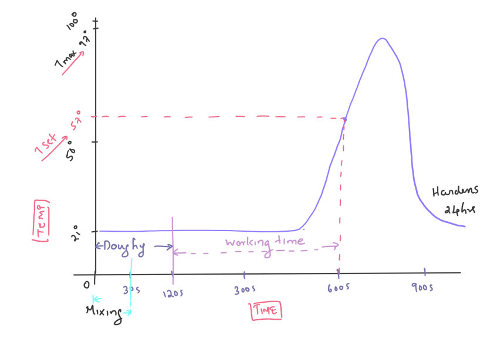
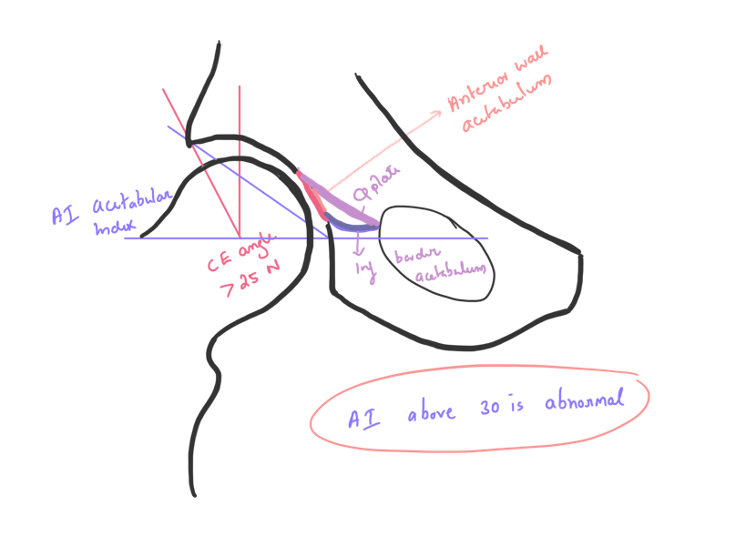
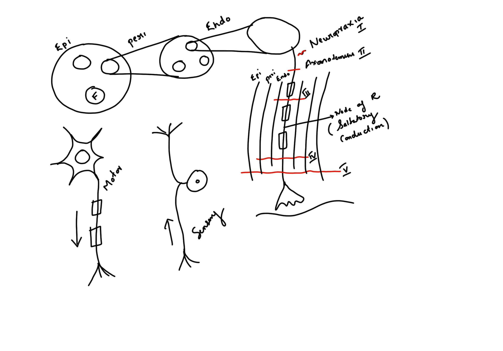
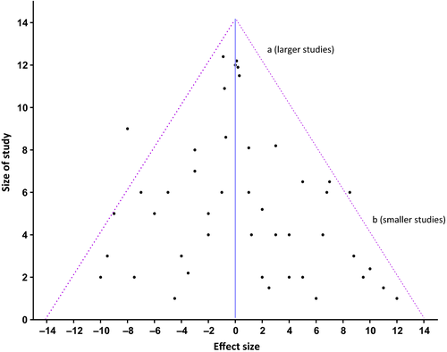

--- 
title: "knotes"
author: "Kishore Puthezhath"
date: "2024-05-01"
site: bookdown::bookdown_site
documentclass: book
bibliography: [book.bib, packages.bib]
url: https://knotes.co.in
# cover-image: path to the social sharing image like images/cover.jpg
description: |
  kishore Puthezhath’s official website.Kishore Puthezhath MS Ortho, D Ortho, FACS (USA), FRCS (Tr & Orth)(Eng) is a Professor of Orthopaedics under KUHS. He is currently pursuing his PhD in orthopaedics and his research interests include fracture healing and cross talk between brain and bone. He leads the Paediatric Orthopaedics Surgery in a tertiary teaching hospital in Kerala.
link-citations: yes
github-repo: drkmenon/knotes
---

# About {-}

I am a Professor of Orthopaedics. Currently I am pursuing a PhD in orthopaedics and my research interests include fracture healing and cross talk between brain and bone. I lead the Paediatric Orthopaedic Surgery in a tertiary teaching hospital.

This compilation represents a collection of notes and insights I have gathered over the years, primarily focusing on topics related to Biometry, Orthopaedics, Medical Education, Health economics and my general experiences in the field. It serves as a reflection of my journey and learning in these areas, encapsulating both the technical aspects of these subjects and the practical experiences I have encountered.

## Contents {-}

<!--chapter:end:index.Rmd-->

# (PART) Orthopaedic Notes {.unnumbered}

# Basic Science

## Bone healing.

Skeletal fracture occurs when bone absorbs sufficient energy under mechanical loading to fail, resulting in cortical discontinuity.\
<mark> **Fracture healing is the biological process by which trabicular discontinuity of a bone is restored**.</mark> This requires temporal coordinated action of several different cell types, proteins and the expression of hundreds of genes working towards restoring its structural integrity without scar formation.Fracture healing is nothing but reiterating embryonic endochondral bone formation

> **Fracture healing is unique**.

> -   Resulting bone both microscopically and macroscopically completely resembles that present prior to injury.
> -   Bone repair is similar to those observed during embryonic bone formation and this is therefore truly a regenerative process.
> -   The essential difference between bone healing and the healing of any other tissue is unlike any other tissue, **bone heals with out scar**.

**Cortical** and **cancellous bone** heal by slightly different mechanisms. Interplay between at least four different factors are identified which can greatly effect this process.

1.  Stability
2.  The scaffold
3.  Growth factors
4.  Osteo-progenitor cells.

This is the basis of **Diamond concept** of healing which we will discuss later.

(\#fig:diamond)Diamond concept,fracture healing

When given a chance to heal with minimal gap in between the fractured ends, bone heals by **primary** intention which is called primary healing. In other situations with bigger gaps in between the fractured ends, they heal by **secondary** intension, which is called secondary healing. This effect of *gap* on the fracture healing process is due to its affect on the *strain* which is called **fracture gap strain** which is given by the formula ∆FGap/FGap as described by **Perrin**.

> Strain is the deformation of a material when a given force is applied. <mark>Fracture gap stain is the ratio of relative displacement of fracture ends versus initial fracture gap width.</mark>

------------------------------------------------------------------------

Percentage of strain determines the type of tissue formed during the healing. The strain will be less-

-   With large fracture area (less ∆FGap)
-   More number of fracture fragments.
-   Less gap in between the fracture fragments.

| Strain | Type of tissue formed | Type of healing | Stability            |
|--------|-----------------------|-----------------|----------------------|
| 100    | Granulation           | \*              | Absolute instability |
| 17     | Fibrous tissue        | \*              | Unstable             |
| 2-10   | Fibrocartilage        | 2\^0 healing    | Relative stability   |
| \<2    | Lamellar bone         | 1\^0 healing    | Absolute stability   |

: Strain and bone healing

Percentage of strain determines the type of tissue formed during the healing.

------------------------------------------------------------------------

#### Primary bone healing.

##### Cortical bone

Cortical bone heals by *Osteonal remodeling* by **Osteonal cutting cones** if there is no gap. This requires

-   absolute stability (with strain \< 2%)
-   No gap
-   Viable bone ends

(\#fig:gap)Gap healing

<mark>If there is gap but \< 500µm, healing is by **gap healing**. *In gap healing, osteoblast lays down sequential layers of bone to close the gap*.</mark>

##### Cancellous bone.

Heals primarily by a mechanism called **bony ingrowth**. Here revascularisation followed by osteoblasts laying down new bone.

(\#fig:ingrowth)Bone ingrowth

*Bone ingrowth in cancellous bone*

#### Secondary bone healing

Ham in 1930 published a description of early phases of bone healing after studying fractured rabbit fibulae and ribs. Phases of bone healing was more fully described by **McKibbin in 1978**. In simple terms, bone heals in 3 phases, like any other tissue.

(\#fig:secondary)Secondary healing

##### Phases of bone healing

1.  Inflammation
2.  Cellular proliferation and differentiation
3.  Remodeling.

However the process is complicated by high specialisation and calcified nature of bone.

Differentiation of primitive mesenchymal stem cells in to cells with osteogenic potential result in a specialized connective tissue formation called callus. **Ambient strain stimulate fracture gaps to form callus** . For this the strain environment should be 2%-10%. **Bio-mechanical function of the callus is to reduce strain** by

1.  increasing the diameter of the fractured area.
2.  Increasing the stiffness.

##### Soft and Hard callus.

**Soft callus**: Central, due to endochondral ossification.

**Hard callus**: Peripheral, due to intramembranous ossification

#### Remodelling

2\^0 process directed by osteoclastic resorption \* via howship lacunae in metaphysis \* via Osteons in the cortices. \* Involves complex interplay of RANK-RANKL

(\#fig:rank)RANK-RANKL

<!--chapter:end:3.1-basic-science.Rmd-->

# Adult Pathology

## Charcot

#### Definition

It is a non infectious,destructive process culminating in dislocations and periarticular fractures in patients with peripheral neuropathy and loss of protective sensations

0.1 to 29% incidence

50% need one operation in life time

15-67% chance of amputation

#### Clinical features

-   Pain
-   Local rise of temparature >3-50 compared to normal
-   Swelling
-   Deformity

#### Cahrcot vs Infection

| Charcor                               | Infection                                  |
|---------------------------------------|--------------------------------------------|
| Limb elevation decreases inflammation | No                                         |
| No                                    | Increased ESR,CRP,IL6                      |
| No                                    | Istope (In +Tc)scan positive, PET positive |

#### Classification

##### Eichenholtz

| Stage | Name             | Features                |
|-------|------------------|-------------------------|
| 0     | Prefragmentation | Inflammation            |
| 1     | Fragmentation    | Subluxation,dislocation |
| 2     | Coalascence      | decreased inflammation  |
| 3     | Consolidation    | No inflammation         |

#### Progression

0-1 in 6 months and 2-3 in 12-14 months

#### Causes

-   Endocrine: DM, Renal failure, Alcohol
-   Infection: Leprosy, syphilis
-   Neurogenic: CP, Syrinx,Myelomeningocele, cord injury
-   Idiopathic

#### Theories

-   Neurotraumatic
-   Neurovascular ( **Autonomic dysfunction causing bone resorption**)
-   Inflammatory theory (**Favored, Here injury lead to inflammation and activate RANK-RANKL pathway leading to bone resorption**)
-   ADA, 2011 suggests a hybrid of all theories

#### Clinical examination

##### Look

Stand the patient and look for deformity. Most common are **Rocker bottom and Planovalgus**

Walk the patient and look for Clawing and also have a look at the foot wear

Sit the patient and look for deformity, ulceration and inflammation

##### Feel

Temperature, tenderness, pulse and sensation

##### Move

The joints

##### Special tests

Silfverskiöld test, Vibration, **offer probing the ulcer**

#### management principles

1.  Stop inflammation
2.  Protect and maintain foot architecture
3.  Relieve pain
4.  Arrest or reverse de-mineralisation
5.  Prevent/limit deformity
6.  Control DM

> Suspect Charcot if there is a deformity associated with inflammation, perepheral neuropathy with or without renal failure

> Suspected a/c Charcot: always take a weight bearing X Ray, if negative take MRI

> Immediatly refer to MDT

#### MDT approach

1.  Non removable offloading device
2.  **No Bisphosphonates**
3.  Monitor by Foot Skin temperature assessment and seriel xrays until inflammation resolves

#### When will you say that inflammation is resolved?

-   Temperature difference of \< $2^0$ between the feet
-   Seriel xrays show no progression

## Diabetic foot

Diabetes is a systemic disease which causes - Neuropathy - Vasculopathy - Ulceration - Deformities

Hence it requires a MDT approach for diabetic treatment. This include Hospital based MDT and Community based foot protection service

#### Assessment

1.  How well the diabetes is controlled: **HBA**1C

2.  Presence of neuropathy

    -   Motor: **Deformities, intrinsic minus, weak TibAnt, MT head pressure**
    -   Sensory: Loss of protective sensation (10g S-W monofilament, vibration 128hz)
    -   Autonomic: Dry skin, nail changes,increased vascular response to trauma

3.  Presence of Vasculitis

    -   ABPI >0.45 and triphasic flow in dopplar
    -   TrC-O2 >30
    -   Absolute toe pressure >40 mmHg
    -   Pulse

4.  Presence of Ulceration

    -   Ulceration could be either infected or non infected. In all ulcers, we have to rule out ischemia (vascular ulcer) and Neuropathy.

5.  Deformities

#### Classification

-   SINBAD for ulcer
-   University of texas classificatio for foot

##### SINBAD Classification

-   Site
-   Ischemia
-   Neuropathy
-   Bacterial infection
-   Area
-   Depth

##### University of Texas Classification

| Grade | 0                          | 1                | 2          | 3            |
|-------|----------------------------|------------------|------------|--------------|
| Stage |                            |                  |            |              |
| A     | Foot at risk               | Supeficial Ulcer | Deep Ulcer | Bone exposed |
| B     | Infected                   |                  |            |              |
| C     | Ischemic                   |                  |            |              |
| D     | Both infected and ischemic |                  |            |              |

#### Management

1.  **General**: Prevention, education and accomodative foot wear.
2.  Ulcer management It depends on whether the ulcer is infected or not.

##### Uninfected ulcer manaagement

if the ulcer is uninfected we should be first differentiate wheter it is neuropathic or vascular ulcer.

 Neuropathic ulcers

-   Seen under the metatarsal heads
-   Punched out
-   Painless
-   Healthy granulation
-   Pulse will be present
-   There will be loss of vibration sensation 

Treatment is Total Contact Cast followed by accomodative footwear.

 Vascular ulcers

-   Seen any where
-   Painful
-   Pulse may be absent

Requires vascular team assessment for angioplasty/bipass. This will be followed by TCC and accomodative foot wear

##### Infected ulcer management

If the ulcer is ischemic, it should be managed by vascular team

Otherwise, the local hospital team will be managing and that range from appropriate antibiotics as per culture to Amputation.

#### Deformity management

##### A/C presentations that need surgery

-   Medical dislocation of T-N joint causing plano valgus deformity
-   Dorsal dislocation of T-N joint causing lateral rocker bottom
-   Infection requiring drainage/sepsis
-   Ischemia/gangrene

##### Chronic deformities

###### Principles

-   prolonged non weight bearing (4 months) followed by protected weight bearing
-   TCC/Accomodative foot wear is the main stay treatment
-   prefer arthrodesis over ORIF

## Tuberculosis of Locomotor system

Out of the total population of patients with tuberculosis, if we forget the less important organs like head, chest and abdomen, the subset of people with locomotor system TB comes to about 1-2%. Of this 50% is spinal, 15% hip and 10% knee. Rest of the patients will have other joint area or bone involvement.

They are predominantly paucibacillary type, meaning, the chances of you finding mycobacteria in specimens is near unlikely. That make the diagnosis difficult and treatment trouble-sum.

#### Diagnosis

My approach to diagnosis is PaTeNDed.

-   Pa-Pain

-   Te-Tenderness

-   N-Neurology

-   Ded-Deformity

Particular problem is with pain. Almost all patients come to an orthopaedic surgeon for pain. Our task is to filter out a small portion of organic pain from a big collection of mechanical and somatic pains. One useful rule of thumb is

> *organic pains increase after a period of rest and are most often associated with rest pain and night pain*

The moment we see such a patient, and especially if associated with localised tenderness, subtle neurological findings or deformity, we have to think about 3 potential diseases

1.  Malignancy

2.  Infection

3.  Inflammatory diseases

We should always suspect TB in that situation.

TB spine can be

-   Para-diskal -->Arterial spread (most common)

-   Central --> Venous

-   Anterior-->Sub-periosteal

-   Posterior-->Unstable (rare)

Taking a baseline xray is the first investigation we can quickly do. ESR and CRP has got prognostic values. Contrast enhanced MRI, preferably Gadolinium is the best screening test available. If the MRI picture is suggesting infection, take a biopsy under CT guidance. The specimen should be sent for

1.  HPE

2.  Mycobacterium and other cultures

3.  NAAT test

4.  Staining

#### NAAT

Specimen for NAAT should be sent in sterile container, in saline if there is chance of drying. There should be 2 specimens.

CB-NAAT (Cartridge based) and TRU-NAAT (Card based) are the two types of tests available. Both are recognised by WHO and NTEP for diagnosis of TB. One important point is that the specimen should not contain blood or urine, which can reduce the sensitivity of the test. Overall solid tissue is preferred over liquid. The test, apart from diagnosis, helps in identifying **Rifampicin** sensitivity. If the speciment is resistant to RIF, send the second sample for Genotypic/phenotypic drug resistant test. LPA (line probe analysis) is a rapid test and can be employed to detect resistance against first and second line drugs.

#### Culture

The culture medium of choice is MGIT (Mycobacterium Growth detection Tube). It is prone for contamination, but yields result in 2-4 weeks. But always co-culture in LJ medium to mitigate the problem of contamination.

#### HPE

Pathologists look for

-   Epitheloid cells

-   Granuloma

-   Lymphocytic infiltration

#### Treatment

-   ATT- 2HREZ + 10-16 HRE (16 for spine)

-   Immobilisation

-   Surgery

#### Indications for surgery

1.  Neurological complications, especially worsening with medical management

2.  Non neurological complications

Non neurological complications that may warrant surgery include

-   M- Mass effect, mechanical instability

-   D-Deformity

-   R-Resistance

Tuli classification of Neurology

1.  Not aware of weakness

2.  Aware of weakness

3.  In extension

4.  In flexion

#### Follow-up

-   Weekly- Assessment of neurology

-   3 monthly- X-Rays

-   6 monthly- MRI

-   Follow-up up to 2 years after completion of treatment

## Osteoporosis

#### Definition

Decrease in bone mass with micro architectural deterioration

<!--chapter:end:3.2-Adult-Pathology.Rmd-->

# Diagrams for viva

## Action potential

(\#fig:unnamed-chunk-1)Action Potential

## Articular cartilage

(\#fig:unnamed-chunk-2)Articular cartilage

## Femoral head supply

(\#fig:unnamed-chunk-3)Blood supply femoral head

## Brachial Plexus

(\#fig:unnamed-chunk-4)Brachial Plexus

## Carpal Tunnel

(\#fig:unnamed-chunk-5)Carpal tunnel incision

(\#fig:unnamed-chunk-6)Carpal tunnel contents

## Cement

(\#fig:unnamed-chunk-7)Curing of bone cement 

## Motion segment

(\#fig:unnamed-chunk-8)Motion segment

## Femoral teardrop

(\#fig:unnamed-chunk-9)Tear drop and lines

## Spinal cord

(\#fig:unnamed-chunk-10)Spinal cord cross section

## Nerve

(\#fig:unnamed-chunk-11)nerve

<!--chapter:end:4.1-ortho-diagrams.Rmd-->

# (PART) Quality {-}
# Clinical audit 

>>It is a quality improvement tool for evaluating and improving patient care and outcomes. This is achieved by systematically reviewing current practices against explicit criteria and measuring the impact of change(s) introduced to generate improvement. 

The clinical audit process can be described by “Plan,” “Do,” “Study,” “Act” phases that comprise an audit cycle.

(\#fig:unnamed-chunk-1)*Figure 1:The audit cycle, showing the 4 necessary steps of a complete audit cycle, from planning an audit (“Plan”), to the collection and analysis of data (“Do” and “Study”) and identifying steps leading towards improvement (“Act”). The cycle is intended to be repeated with the goal of continuous improvement. Adapted from Langley et al*

## Method

### Plan

+	Identifying an area  where there are certain standards that need to be met. 
+ Setting evidence based standards for the quality improvement project derived at a Local level – i.e. hospital derived, Regional level or National level 
+	This stage should identify where and how data should be collected.

### Do
+	Measurement of clinical practice requires:
+	A population to audit: with predefined with inclusion and exclusion criteria.
+	A data collection tool.
+	Once data are collected they must be analysed before implementing change.
	
### Study
+	This requires comparison of current practice, as collected during stage 2 of the cycle (Measuring), with best practice and identifying areas where change needs to be made.
+	Changes made to practice are often in line with the other key areas of clinical governance, these can include:
+	Education and training
+	Clinical effectiveness
+	Risk management
+	Staffing management
	
### Act
+	This requires maintenance of the changes to practice in line with best practice standards. Again, this necessitates adherence to the other key components of clinical governance.
+	One of the fundamental parts of clinical audit and sustaining improvement is re-audit. It is often referred to as completing the cycle and entails repeating the stages of clinical audit to provide objective evidence that the improvement is sustained.

## Audit is not research
 + Clinical audit differs from clinical research.
 + Clinical research is focused on establishing an evidence base of what best practice.
 + Clinical audit which aims to ensure that best practice, having been identified through clinical research, is being adhered to and that these standards are being met.
 

<!--chapter:end:5.1-Quality.Rmd-->

# (PART)  Research {-}
# Research Methodology
## p-value and CI

(\#fig:unnamed-chunk-3)Histogram showing  male and female height ploted againt the count

Assume that we have a normally distributed population of males and females with a mean height of 168.5444368cms and 157.8109596cms respectively.

We can see that the mean difference in the height is 10.7334772  
**If I measure the entire population in the world, will I find that the mean height for each sex is different?** or  
**would I find that difference between the mean height is zero?**

##### How to answer this question?

#### Frequentist method
Assume a hypothetical world with no difference in the height between the sexes.Do repeated experiments and find out what `proportion of times` would I obtain a difference between the observed means(ø) in that hypothetical world which is as great as or greater than difference I observed in my real experiment.
**This proportion of time is abbreviated as *p-value* **  

In other words *p-value*=P(ø/H), given the null(H), what is the probability of data(ø)

but *p-value* is an answer to a question we didn't intend to ask. So what to do with it?

#### Traditional Answers

##### Fisher

Treat it as a measure of strength of evidence. This is not objectively satisfactory because, *p-value*=P(ø/H)≠P(H/ø)

##### Neyman-Pearson decision framework

In each experiment, if you need to choose between the Null and the alternative, then there is possibility for two types of errors

False Positive: Choosing the alternative when Null is true

False Negative: Choosing the Null when the alternative is true

>>**Control the rate at which you commit decision errors of false positive type by applying a strict procedure to each experiment:**

**The researcher has to make a decision**. In research, convention is to choose the alternative hypothesis if the test result is outside the 95% mark in the normal curve. The remaining 5% is called `œ`. The boundary is approximately `1.96z`, ie,  1.96 standard deviations away from the mean.

>A Z-score is a numerical measurement that describes a value's relationship to the mean of a group of values. Z-score is measured in terms of standard deviations from the mean. If a Z-score is 0, it indicates that the data point's score is identical to the mean score. A Z-score of 1.0 would indicate a value that is one standard deviation from the mean. Z-scores may be positive or negative, with a positive value indicating the score is above the mean and a negative score indicating it is below the mean.

>`œ` is the zone of rejection of null hypothesis and `z` the boundary between the acceptance and rejection zones of  null hypothesis.

If we refer the statistical charts, p value for a `z` score of ≤1.96 is ≤0.05

##### So the decision framework is to

 + Compute *p-value*
 + Choose the Null if *p-value* is > α 
 + Choose the alternative if *p-value* is <= α
 + Typically α is set at 0.05

Another important concept is **confidence interval**

## Confidence Interval

Under repeated sampling in hypothetical world, 95% of confidence intervals constructed the same way will include the true value of the mean difference.

It ranges between a fixed value x and y on either side of zero,i.e., `x-0-y`. 

0-x is the lower confidence limit and 0+y is the upper confidence limit.

##### **Confidence limit**
 This sets the boundary of confidence interval and it is generally taken as 95%.

confidence interval is generally considered as more important than p value because it gives

+ Statistical significance
+ Clinical significance
+ Precision

## Funnel plot

**Introduction**

#### Talking the talk

(\#fig:funnel1)Funnel Plot

**Doctor,what do you see here?**

This is called a funnel plot which is a simple scatterplot of the treatment effects (RR or OR) estimated from individual studies (horizontal axis) against the precision of the studies represented by standard error (SE).

The vertical dotted line shows the estimated combined RR or OR from the meta-analysis. The diagonal dotted lines show the range in which studies should be ideally distributed given the size (and thus precision) of each study. Thus larger (big sample size), more precise (smaller standard error) studies should be closely distributed either side of the pooled effect and smaller studies should be distributed more widely giving the classic inverted symmetrical funnel. If the studies are not distributed randomly (due to sampling error) around the combined RR estimate then some other influence is suggested.

(\#fig:funnel2)Assymetric Funnel Plot

**Now what is this?**

This funnel plot shows trials scattered asymmetrically around the pooled RR with smaller trials reporting a greater effect than larger ones.

Two possible explanations are: smaller trials of lower methodological quality tend to overestimate true effect; **publication bias** has led to the smaller negative trials remaining unpublished.

(\#fig:funnel3)Outliers, Funnel Plot

**If so, what is this?**

The funnel plot displays the % of observed 30-day mortality rate of operations on the Y-axis and the total number of operations on the X-axis. A practice lying on the line Y=1 has a surgeon performing close to average, whereas a practice lying above Y=1 has a the total number of operations that is higher than the average.

**Important point**

Funnel plot is used to detect publication bias as well as outliers

#### **Funnel plot**

This is a common question for FRCS(Tr & Orth) viva. To understand the concept, we have to give some thought in to the basis of this statistical tool. Let us start from the very base.

#### Understand the concept

Mean, median, and mode are three kinds of "averages". There are many "averages" in statistics, but these are most common.

**"mean"** is a statistical "average", where you add up all the variables and then divide by the number of variables.

The **"median"** is the **"middle"** value in the list of variables. To find the median, your variables have to be listed in numerical order from smallest to largest, so you may have to rewrite your list before you can find the median.

The **"mode"** is the value that occurs most often. If no variable in the list is repeated, then there is no mode for the list.

To understand funnel plot we should also know the statistical concepts of  *variance* , *standard deviation* and *standard error of mean*.

## Variance

**It is the sum of average squared difference of mean**.

eg: x\~1, x\~2, x\~3, x\~n are a list of *n* number of values, then mean, x̄ = (x\~n + x\~1 )/n. Then the **Variance**=Σ (x-x̄)\^2/ (n-1).

## Standard deviation

*It is the measure of standardized dispersion of data from the mean. It is calculated by taking the square root of variance.*

Standard deviation σ = √∑, i.e., standard deviation is the square root of variance.

Assume that someone is asked to walk on a straight line from point *a* to point *b*. The individual steps taken by the person can be equated to standard deviation and the variance is the deviation of the path from the central line.

(\#fig:funnel4)walking with variance and sd

σ is the sd and Σ is the variance

> Unlike standard deviation **variance** can identify the outliers and also shows the spread of the data.

## standard error of mean(SEM)

It is the standard deviation of the sample mean from the population mean.

Assume that there is a population of 1000 members. In order to study the average height of the population, we have to select a sample size. Also assume that one scientist *y* started a study with a sample size of 50. He repeated the study for *n* times. He found that each time the average height found out from the study was different. He calculated the mean value of the height from these *n* studies and designated it as x̄\~1. This x̄\~1 is the **sample mean** for his study.

Another scientist *z* selected a sample size of 10 and conducted *n* number of similar study and similarly he also got a sample mean, x̄\~2. So they decided to find out the actual population mean x̄ by studying the entire population. They also calculated how far the x̄\~1 and x̄\~2 deviate from x̄. The deviation of x̄\~1 was found to be less than x̄\~2. This deviation is called **Standard error of mean**

> when *n* increases, **standard error of mean** decreases and the precision of the study increases.

**This is the basis of funnel plot.**

#### Funnel plot concepts

It is a representation of **SEM** plotted against the true population mean or the no effect line of a study in a graph. Smaller studies tend to have larger SEM and the larger studies will have smaller SEM. Hence the plot assumes a funnel shape. I an ideal world, **funnel plot** is supposed to form a symmetrical "funnel". This is not the case in real world, because of various reasons.

#### Uses of funnel plot

-   To identify outliers. Eg: A surgical resident's performance
-   To identify the validity of a meta-analysis. An asymmetrical funnel plot suggests a potential problem with the results of the meta-analysis.

#### Causes of asymmetrical funnel plot

1.  Reporting bias

    -   Reporting bias

        -   Publication bias: Delayed reporting, language bias, duplication)
        -   Selective outcome reporting
        -   Selective analysis reporting

2.  Poor methodology

    -   Design
    -   Analysis
    -   Fraud

3.  Heterogeneity

4.  Chance

#### Heterogeneity

**Variations over and above that is expected by chance**

predicts whether the data from different studies can be combined for meta-analysis to obtain a forest plot.

##### Causes

| Clinical                          | Statistical                         |
|-----------------------------------|-------------------------------------|
| Difference in the population      | Individual results are inconsistent |
| Difference in the study design    | Difference in size of benefit       |
| Difference in intervention        | Difference in size of harm          |
| Difference in outcome             |                                     |
| Always present                    |                                     |
| Cannot be statistically evaluated | Can be evaluated statistically      |

#### Detecting Heterogeneity

-   Review the table describing individual studies
-   "eye ball test", review the forest plot
-   Review the statistical tests
-   Statistical tests

#### Statistical tests for detecting heterogeneity

-   Tests for its presence: Chi Square test, p>0.1 means study is homogenous

-   Test to quantify: I\^2

    -   It measures the % of heterogeneity (≤25%----low, 50%----moderate, ≥75%----high)

#### Analysis of cause of heterogeneity

Once heterogeneity is identified and quantified, he have to analyze and find out why it is present

##### This is done by

-   subgroup analysis
-   Metaregression

<!--chapter:end:6.1-research.Rmd-->

# (PART) Economics {.unnumbered}

# Health economics

## Impact funds

Let's embark on a thought experiment involving two cities: Pharma City and Social City, each with an identical population of 1,000 residents. In both cities, five individuals have contracted a novel disease characterized by watery diarrhea, known as Cholera. A pharmaceutical company has developed an innovative treatment, named ORS, with a treatment course priced at \$84,000. Concurrently, another research has identified the root cause of the infection: contaminated water supply. Addressing the water quality issue involves an expense of \$420 per person. With a budget of \$420,000 at your disposal, you face a decision: allocate this amount as a Pharma Impact Fund in Pharma City or as a Global Impact Fund in Social City. Which city would you choose to assist?

## Osteosarcopenia

#### The Silent Geriatric Giant

"*It takes a child one year to acquire independent movement and ten years to acquire independent mobility. An old person can lose both in a day.*" --- Professor Bernard Issacs

The term "geriatric giants" was coined by Professor Bernard Issacs in 1965 to describe a group of conditions: immobility, incontinence, instability, and impaired intellect. These conditions are considered "giants" due to their high prevalence and the immense burden of suffering they impose on the geriatric population, necessitating medical and social intervention. Over the years, extensive research has focused on these giants, making them a primary target for geriatricians.

Recently, Professor Duque and colleagues from the Australian Institute for Musculoskeletal Sciences identified an even larger giant: Osteosarcopenia. In a 2021 article published in the Journal of Nutrition, Health & Aging, they highlighted the twin problem of Osteosarcopenia. On one hand, it is highly prevalent, and its impact is profound. On the other hand, it has not received the equal recognition and precedence in clinical practice.

During the first decade of our life, we develop a high level of independence and mobility, strongly associated with progressive increases in muscle and bone mass. However, by the third decade, this peak begins to decline. In a significant proportion of older individuals, several risk factors contribute to both Osteoporosis (decreased bone mass with micro-architectural deterioration) and Sarcopenia (loss of muscle mass, strength, and function). Emerging evidence suggests that these two pathological conditions can coexist.

The term "Sarco-osteopenia" was proposed by Binkley and Buehring in 2009 to describe a subset of frail older individuals with osteopenia/osteoporosis and sarcopenia. These individuals face a higher risk of falls, fractures, frailty, and morbidity. Later, the term evolved into "Osteosarcopenia".

Prevalence estimates for osteosarcopenia range from 5% to 37% among community-dwelling older individuals in various studies conducted in Japan, Iran, Germany, Australia, and China. Unfortunately, there are no published studies from India yet, specifically addressing the prevalence of this condition among the geriatric population.

Advancing age is a well-established risk factor for Osteosarcopenia. Other potential risk factors include malnutrition, high body fat, diabetes, depression, physical inactivity, and low educational levels. Researchers propose that short leukocyte telomere length (Kirk et al.) and intermuscular fat infiltration (Al Saedi et al.) contribute to the coexistence of Osteosarcopenia and serve as predictors of falls and fractures.

Why is Osteosarcopenia relevant? Without early and prompt interventions, it predisposes older individuals to falls, fractures, disability, frailty, and premature mortality. The Canadian Longitudinal Study on Aging (CLSA), which included 30,097 males and females aged 45-85, concluded that osteosarcopenia was associated with falls, fractures, worse life satisfaction, and limitations in activities of daily living (ADL). In 2010 alone, the European Union had 27.5 million people living with osteoporosis, resulting in approximately 3.5 million fragility fractures and a cost exceeding 37 billion euros. These numbers are projected to increase by 25% by 2025. The Hertfordshire trial estimated an annual cost of £2,707 per person, with an overall cost of £2.5 billion in 2018.

Despite the prevalence of osteoporosis being estimated at 8-62% among Indian women, as reported in a 2023 narrative review by Agarwal et al., there is a noticeable lack of studies from India that describe the prevalence and socioeconomic impact of Osteosarcopenia. This gap in research urgently needs to be addressed. Furthermore, the development and application of accurate diagnostic methods for identifying Osteosarcopenia and predicting associated falls and fractures are of paramount importance.

There are no screening or risk calculation tools validated for osteosarcopenia. However, numerous tools are available to diagnose both osteoporosis and sarcopenia. SARC-F, a 5-point sarcopenia questionnaire recommended in the most recent international consensus guidelines, has limited use as a screening tool due to moderate sensitivity. However, validated tools are available for screening and risk stratification in those with osteoporosis which include the FRAX, widely used and cited.

Bone Mineral Density testing with DEXA is a specific tool for the diagnosis of osteopenia and osteoporosis. According to WHO diagnostic criteria, a t-score of -1 or less classifies the individual as having osteopenia, and -2.5 or less as osteoporosis. The European Working Group on Sarcopenia in Old People (EWG-SOP 2) has established cut-off points for the definitive diagnosis of sarcopenia: Appendicular Skeletal Mass Index (ASMI) \< 7.0 kg/m2 in males and \<5.5 kg/m2 in females; Muscle strength \< 27kgf for men and \<16 kgf in women. Serum 25(OH) vitamin D, calcium, parathyroid hormone, and serum testosterone (in men) can help in detecting most secondary causes of pathology leading to falls and fractures.

Treatment of osteosarcopenia is not well defined. Randomized controlled trials have demonstrated the efficacy of progressive resistance and balance exercises to prevent osteosarcopenia. Whey protein, Vitamin D, and Calcium are nutritional supplements that may help in preventing osteosarcopenia. Pharmacotherapy specifically for osteosarcopenia has not yet been developed. Denosumab, a RANK ligand inhibitor, has shown promising effects on bone and muscle.

In summary, osteosarcopenia should be identified as a new geriatric giant of our time due to its high prevalence and vast burden of sufferers. Awareness of this condition as a geriatric syndrome should increase, and its prevention, identification, and treatment should become a priority. It should act as a unifier in a set of fragmented fields in which osteoporosis, sarcopenia, falls, and frailty are identified and managed by various specialists. Focused research in this direction could finally improve care for this silent killer.  

<!--chapter:end:7.1-economics.Rmd-->

# References {-}

<!--chapter:end:8-references.Rmd-->

